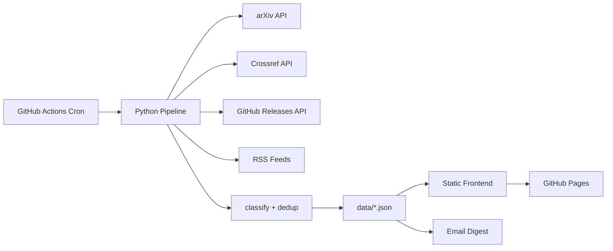

# PORID — Personal OR Intelligence Dashboard

**`v1.0`** · Operations Research Intelligence, Automated

A self-updating dashboard that aggregates the latest publications, software releases, conference deadlines, and academic opportunities across Operations Research and related fields. Powered by a Python data pipeline running on GitHub Actions, it delivers a polished static frontend on GitHub Pages and optional daily email digests — all with zero infrastructure cost.

## Architecture



**Data flow:** A daily GitHub Actions cron job runs the Python pipeline, which fetches from five sources (arXiv, Crossref, GitHub, conference configs, RSS job feeds), classifies items by OR subdomain, deduplicates across sources, and writes static JSON files. The frontend reads these files directly — no server, no database, no build step.

## Setup

### Quick Start (Local Preview)

```bash
git clone https://github.com/mghnasiri/PORID.git
cd PORID
# Open the dashboard directly in your browser
open src/index.html
```

The dashboard loads mock data from `src/data/` and is fully functional offline — filters, search (Cmd+K), watchlist, and dark/light mode all work locally.

### Run the Pipeline Locally

```bash
cd pipeline
pip install -r requirements.txt
python run_pipeline.py          # Fetch live data from all sources
python build_digest.py          # Generate today's digest
python send_email.py --dry-run  # Preview email without sending
```

### GitHub Actions Setup

To enable automated daily fetches and email digests:

1. Push to `github.com/mghnasiri/PORID`
2. Go to **Settings → Pages → Source** → select **GitHub Actions**
3. Go to **Settings → Secrets and variables → Actions** and add:
   - `SMTP_USER` — Your Gmail address
   - `SMTP_PASSWORD` — A Gmail [App Password](https://support.google.com/accounts/answer/185833) (not your regular password)
4. Go to **Actions** → **Daily Data Fetch** → **Run workflow** to trigger the first fetch

The fetch workflow runs daily at 07:00 UTC. Each run auto-commits updated JSON files, which triggers the deploy workflow to publish to GitHub Pages.

## File Tree

```
PORID/
├── .github/
│   └── workflows/
│       ├── deploy.yml              # GitHub Pages deployment
│       └── fetch-data.yml          # Daily data pipeline cron
├── data/                           # Pipeline output (committed by CI)
│   ├── publications.json
│   ├── software.json
│   ├── conferences.json
│   ├── opportunities.json
│   ├── metadata.json
│   └── digest-YYYY-MM-DD.json
├── pipeline/
│   ├── config.yaml                 # Sources, categories, keywords
│   ├── requirements.txt
│   ├── run_pipeline.py             # Main orchestrator
│   ├── fetch_arxiv.py              # arXiv Atom API
│   ├── fetch_crossref.py           # Crossref REST API
│   ├── fetch_software.py           # GitHub Releases API
│   ├── fetch_conferences.py        # Config-sourced conference data
│   ├── fetch_opportunities.py      # RSS feed parser
│   ├── classify.py                 # Keyword-based tag classifier
│   ├── deduplicate.py              # DOI + title similarity dedup
│   ├── build_digest.py             # Daily digest builder
│   ├── send_email.py               # Gmail SMTP sender
│   └── templates/
│       └── digest_email.html       # Jinja2 email template
├── src/
│   ├── index.html                  # Dashboard shell
│   ├── admin.html                  # Config viewer (cosmetic)
│   ├── css/
│   │   └── style.css               # Complete design system
│   ├── data/                       # Frontend data copy
│   │   └── *.json
│   └── js/
│       ├── app.js                  # Main controller + routing
│       ├── components/
│       │   ├── card.js             # Card renderer
│       │   ├── filters.js          # Filter bar + logic
│       │   └── modal.js            # Detail modal
│       ├── modules/
│       │   ├── publications.js     # Publications view
│       │   ├── software.js         # Software releases view
│       │   ├── conferences.js      # Conferences view
│       │   ├── opportunities.js    # Opportunities view
│       │   ├── watchlist.js        # Watchlist (localStorage)
│       │   ├── digest.js           # Digest history viewer
│       │   └── search.js           # Fuse.js search + Cmd+K
│       └── utils/
│           ├── date.js             # Date formatting helpers
│           └── storage.js          # Watchlist localStorage API
├── LICENSE
├── .gitignore
└── README.md
```

## Tech Stack

| Layer | Technology |
|-------|-----------|
| Frontend | Vanilla JS (ES6 modules), HTML5, CSS3 custom properties |
| Search | [Fuse.js](https://www.fusejs.io/) 7.0 (fuzzy search) |
| Fonts | Cormorant Garamond + Inter (Google Fonts) |
| Pipeline | Python 3.11 (requests, feedparser, PyYAML, Jinja2) |
| Data Sources | arXiv API, Crossref API, GitHub REST API, RSS feeds |
| CI/CD | GitHub Actions (daily cron + deploy on push) |
| Hosting | GitHub Pages (static, zero cost) |
| Email | Gmail SMTP via smtplib |

## Design System

Matches the portfolio at [mghnasiri.github.io](https://mghnasiri.github.io/):

- **Background:** `#0A192F` / **Surface:** `rgba(10,25,47,0.85)` with `backdrop-filter: blur(12px)`
- **Accent:** `#C5A059` (Gold) / **Text:** `#CCD6F6` / **Muted:** `#8892B0`
- **Title font:** Cormorant Garamond / **Body font:** Inter
- **Cards:** Gold left-border, surface bg, blur, hover glow

## License

MIT License — see [LICENSE](LICENSE).
